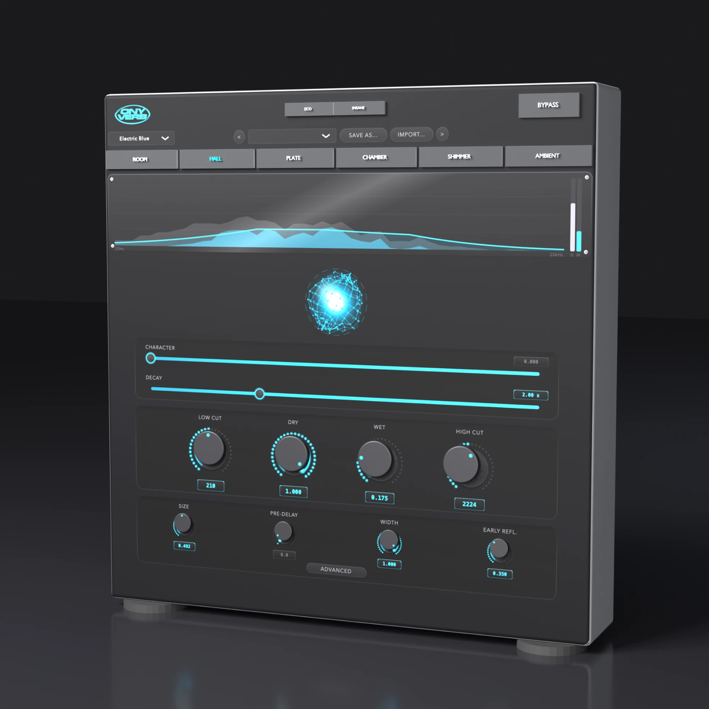

# ONY Verb

A hybrid algorithmic reverb plugin by **ONYVA**. Built on JUCE (CMake), targeting VST3, AU, AAX (SDK-gated), and Standalone.

<p align="center">
  
</p>

## Status

This repo is being built in phases (see `docs/PROGRESS.md` for a running log):

- [x] Phase 1 — JUCE/CMake scaffold, plugin metadata, build targets
- [x] Phase 2 — FDN reverb engine + parameter tree, headless DSP unit tests
- [ ] Phase 3 — Six mode variants tuning pass (needs ears-on listening, not yet done)
- [x] Phase 4 — Custom UI (orb visualizer, decay curve, knobs)
- [x] Phase 5 — UI wired to parameters + live audio data (ring buffer)
- [x] Phase 6 — 12 factory presets, branding, signing/notarizing scripts
- [ ] Phase 7 — Host testing pass (Ableton/Logic/Pro Tools)

## Project layout

```
Source/
  PluginProcessor.{h,cpp}   JUCE AudioProcessor: parameter tree, process callback
  PluginEditor.{h,cpp}      Custom editor: assembles the UI/ components below
  Parameters.h              Parameter IDs + AudioProcessorValueTreeState layout
  DSP/
    FDNReverb.h             Top-level engine: gain/filter -> pre-delay -> diffusion
                            -> early reflections -> FDN tank -> width -> mix
    FDNTank.h               8-line Feedback Delay Network (Hadamard mixing matrix)
    EarlyReflections.h      Stereo multi-tap early-reflection module
    ModeDefinitions.h       Per-mode tuning tables (Room/Hall/Plate/Chamber/Shimmer/Ambient)
    PitchShifter.h          Delay-based octave-up shifter, feeds Shimmer mode
    DSPUtils.h              Filters, delay lines, all-pass diffusers
    VisualizationData.h     Lock-free ring buffer: audio thread -> UI thread
  UI/
    OnyvaLookAndFeel.h      Custom-drawn knobs/sliders/pills (Theme.h holds the palette)
    OrbVisualizer.h         Audio-reactive hero orb (tail energy + transient pulses)
    DecayCurveDisplay.h     Live T60-vs-frequency curve, top strip
    ModePillBar.h           Room/Hall/Plate/Chamber/Shimmer/Ambient tab buttons
    HeaderBar.h             Logo, title, Bypass, A/B compare
    PresetBar.h             Factory + user preset browser (see Presets/ below)
    KnobWithLabel.h         Knob/slider/fader building blocks
  Presets/
    FactoryPresets.h        12 factory presets (2 per mode), applied directly to APVTS
Tests/
  DSPTests.cpp              Headless unit tests (JUCE UnitTest) for the DSP core
scripts/
  sign_and_notarize_macos.sh  Codesign + notarize all built bundles (needs a Developer ID cert)
  sign_windows.ps1             Codesign the Windows VST3 (needs a .pfx cert)
modules/JUCE                JUCE 9.0.2, vendored as a pinned git submodule
```

The DSP layer (`Source/DSP/`) has no dependency on `juce_audio_processors` or
any plugin-format wrapper — it only needs `juce_core`/`juce_audio_basics`/`juce_dsp`,
so `Tests/DSPTests.cpp` and the standalone app both exercise the exact same
engine as the plugin does.

## Building (macOS)

Requires Xcode command-line tools and CMake 3.22+.

```bash
git submodule update --init --recursive
cmake -S . -B build -G "Unix Makefiles" -DCMAKE_BUILD_TYPE=Release
cmake --build build --target ONYVerb_VST3 --target ONYVerb_AU --target ONYVerb_Standalone -j 8
```

Universal (Intel + Apple Silicon) binaries are produced by default via
`CMAKE_OSX_ARCHITECTURES=x86_64;arm64` (set in the top-level `CMakeLists.txt`).

Run the DSP unit tests:

```bash
cmake --build build --target ONYVerbTests -j 8
./build/Tests/ONYVerbTests_artefacts/Release/ONYVerbTests
```

### Code signing & notarization (macOS)

`scripts/sign_and_notarize_macos.sh` signs, notarizes, and staples the VST3,
AU, and Standalone bundles in one pass, once you have a Developer ID
Application certificate installed and a notarytool keychain profile set up:

```bash
# One-time setup:
xcrun notarytool store-credentials "ONYVA-notary" \
    --apple-id "you@example.com" --team-id TEAMID --password "app-specific-password"

# Every release:
ONYVA_SIGNING_IDENTITY="Developer ID Application: ONYVA (TEAMID)" \
ONYVA_NOTARY_PROFILE="ONYVA-notary" \
./scripts/sign_and_notarize_macos.sh build
```

## Building (Windows, x64)

Requires Visual Studio 2022 (Desktop C++ workload) and CMake 3.22+.

```powershell
git submodule update --init --recursive
cmake -S . -B build -G "Visual Studio 17 2022" -A x64
cmake --build build --config Release --target ONYVerb_VST3 --target ONYVerb_Standalone
```

AAX on Windows additionally requires `-DAAX_SDK_PATH=<path to Avid AAX SDK>` (see below).

### Code signing (Windows)

`scripts/sign_windows.ps1` signs the built VST3 with a code-signing
certificate (EV or standard, .pfx):

```powershell
.\scripts\sign_windows.ps1 -PfxPath C:\certs\onyva.pfx -PfxPassword "..." -BuildDir build -Config Release
```

## AAX

The AAX SDK is distributed under NDA by Avid and can't be vendored in this
repo. When you have a copy, point CMake at it and the `AAX` format target is
added automatically:

```bash
cmake -S . -B build -DAAX_SDK_PATH=/path/to/AAX_SDK
```

Without `AAX_SDK_PATH` set, the AAX target is simply omitted from the build —
the plugin code itself has no AAX-specific branches to maintain.

## Presets

12 factory presets ship compiled into the plugin (`Source/Presets/FactoryPresets.h`),
two per mode: Vocal Booth/Live Drum Room (Room), Concert Hall/Cathedral (Hall),
Vintage Plate/Drum Plate (Plate), Warm Chamber/Vocal Chamber (Chamber), Ethereal
Shimmer/Ambient Shimmer Pad (Shimmer), and Infinite Wash/Frozen Texture
(Ambient — the latter with Freeze engaged). They're listed first in the preset
bar's dropdown, above a "User" section for anything saved locally via **Save
As...** (stored as XML under `~/Library/Application Support/ONYVA/ONY Verb/Presets`
on macOS, the equivalent `%APPDATA%` path on Windows).

## Plugin metadata

| | |
|---|---|
| Manufacturer | ONYVA (`Onyv`) |
| Plugin name | ONY Verb (`Onvb`) |
| Category | Reverb / Ambience |
| Bundle ID | `com.onyva.onyverb` |
| Internal processing | 32-bit float, sample-rate agnostic (tested 44.1kHz–192kHz) |
